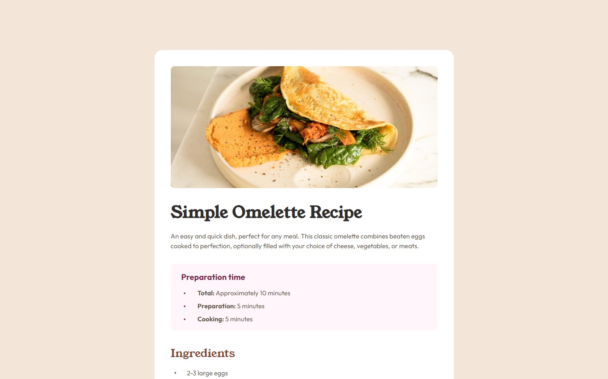

# Frontend Mentor - Recipe page solution

This is a solution to the [Recipe page challenge on Frontend Mentor](https://www.frontendmentor.io/challenges/recipe-page-KiTsR8QQKm).

## Table of contents

- [Overview](#overview)
  - [Screenshot](#screenshot)
  - [Links](#links)
- [My process](#my-process)
  - [Built with](#built-with)
  - [What I learned](#what-i-learned)
  - [Continued development](#continued-development)
  - [Useful resources](#useful-resources)
- [Author](#author)

## Overview

### Screenshot



### Links

- Solution URL: [https://github.com/daHatta/fem-recipe-page](https://github.com/daHatta/fem-recipe-page)
- Live Site URL: [https://dahatta.github.io/fem-recipe-page/](https://dahatta.github.io/fem-recipe-page/)

## My process

### Built with

- Semantic HTML5 markup
- CSS custom properties
- BEM methodology
- Mobile-first workflow
- CSS Preprocessor

### What I learned

I learned to use a CSS preprocessor and setting up an useful folder structure for this project.
With the help of npm I was able to watch on all css changes during the development.

```bash
sass --watch ./assets/css/main.scss ./assets/css/main.css
```

As this project had some tricky design issues, it was nice to deal with _::before_, _::after_ and
_data-attributes_. It was also nice to learn more about tables.

```html
<li data-step="1." class="instructions__list-item">
  <span>bold content</span> content
</li>
```

```css
.instructions__list-item::before {
  color: $clr-primary;
  content: attr(data-step);
  display: inline-block;
  font-weight: $fw-bold;
  left: 7px;
  position: absolute;
}
```

### Continued development

These kind of project was nice to solve in order to get used to semantic html and the change of layouts due to the browser width.
It is important to identify the changes and to build a efficient markup that can be used on all devices. This is a lesson which should be
practiced regularly. Next step should be definitely forms which are important for user interaction.

### Useful resources

- [A (more) Modern CSS Reset](https://piccalil.li/blog/a-more-modern-css-reset/) - This article by **Andy Bell** helped me to reset websites for browser.
- [BEM](https://getbem.com/) - Concept of the BEM methodology is explained on this site.
- [A Modern Sass Folder Structure](https://dev.to/dostonnabotov/a-modern-sass-folder-structure-330f) - This article by **Technophile** helped me to build up an architecture for sass.
- [Stop using @import with Sass | @use and @forward explained](https://www.youtube.com/watch?v=CR-a8upNjJ0) - Great Video by **Kevin Powell** explaining how to set up namespaces etc.
- [CSS with superpowers](https://sass-lang.com/) - Great source to get information about SASS.
- [Google Fonts]() - Used _Outfit_ and _Young Serif_ in this project.

## Author

- Frontend Mentor - [@daHatta](https://www.frontendmentor.io/profile/daHatta)
